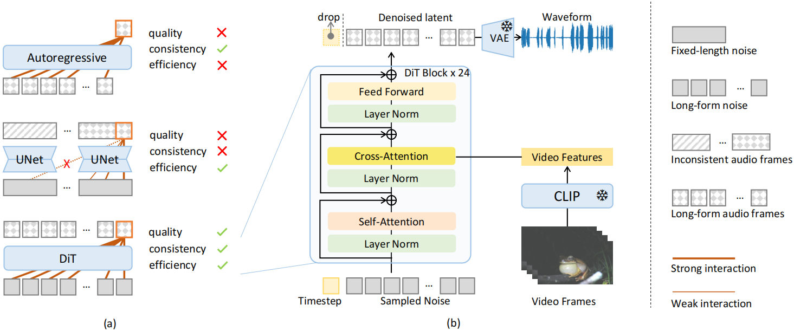

# LoVA: Long-Form Video-to-Audio Generation

:confetti_ball: Our paper has been accepted by ICASSP 2025 !! :confetti_ball: 

## Abstract

Video-to-audio (V2A) generation is important for video editing and post-processing, enabling the creation of semantics-aligned audio for silent video. However, most existing methods focus on generating short-form audio for short video segment (less than 10 seconds), while giving little attention to the scenario of long-form video inputs. For current UNet-based diffusion V2A models, an inevitable problem when handling long-form audio generation is the inconsistencies within the final concatenated audio. In this paper, we first highlight the importance of long-form V2A problem. Besides, we propose LoVA, a novel model for Long-form Video-to-Audio generation. Based on the Diffusion Transformer (DiT) architecture, LoVA proves to be more effective at generating long-form audio compared to existing autoregressive models and UNet-based diffusion models.

Extensive objective and subjective experiments demonstrate that LoVA achieves comparable performance on 10-second V2A benchmark and outperforms all other baselines on a benchmark with long-form video input. Paper can be viewed at [this url](https://arxiv.org/abs/2409.15157). And audio demo can be found at https://ceaglex.github.io/LoVA.github.io/. 

## Environment

- Environment requirement are the same as https://github.com/Stability-AI/stable-audio-tools

  ~~~bash
  git clone https://github.com/Stability-AI/stable-audio-tools.git
  cd stable-audio-tools
  pip install .
  ~~~

- I export the environment dependency manually to `env.txt`, packages can also be installed by

  ~~~bash
  pip install -r env.txt
  ~~~

## Folder Structure

The project code is mainly in `/stable_audio_tools` folder.

- `/stable_audio_tools/config`: 

  Store the model configuration json file.

- `/stable_audio_tools/data`: 

  Store the code for extracting video features and dataset class.

  - clip_feature.py: Use the CLIP model to extract frame information for videos.
  - dataset.py: `VideoFeatDataset` class is used to prepare data during training and testing.

- `/stable_audio_tools/inference`: 

  Store the code for model to do inference.

  - sampling.py: `generate_diffusion_cond` function is used to generate audio waveform given video features.

- `/stable_audio_tools/models`: 

  Store the classes for LoVA model and its different components.

  

## Run Demo
Demo code is available in demo.ipynb. 

- Download the model weight from url https://pan.baidu.com/s/1CdzPIqsAma5Bq5YEXpOARg?pwd=tkda and put it under `.\weight ` folder.

  （You can also download form google drive: https://drive.google.com/file/d/1cpm6g5ldQmhGABqW692MBYfykZ5agfti/view?usp=drive_link)

- At the first step,  Modifing the model configuration json path (`model_config_file`) and model weight safetensors path (`model_weight`) .

  ~~~python
  model_config_file = './stable_audio_tools/configs/model_config_vl30.json'
  model_weight = './weight/epoch=60-step=2818.safetensors'
  ~~~

- At the second step, input the mp4 video by changing `conditioning['feature']`

  ~~~python
  conditioning = {
      'feature': ['./asset/deom_video.mp4']
  }
  ~~~

- Run the two cell and the generated waveform is saved in `./asset/demo_audio.wav`.

## TODO：

The current implementation of LoVA is relatively simple and requires further refactor due to time constraints. 

We plan to provide a more polished and well-documented version of the code following acceptance.

## Cite
~~~
@article{cheng2024lova,
  title={LoVA: Long-form Video-to-Audio Generation},
  author={Cheng, Xin and Wang, Xihua and Wu, Yihan and Wang, Yuyue and Song, Ruihua},
  journal={arXiv preprint arXiv:2409.15157},
  year={2024}
}
~~~
